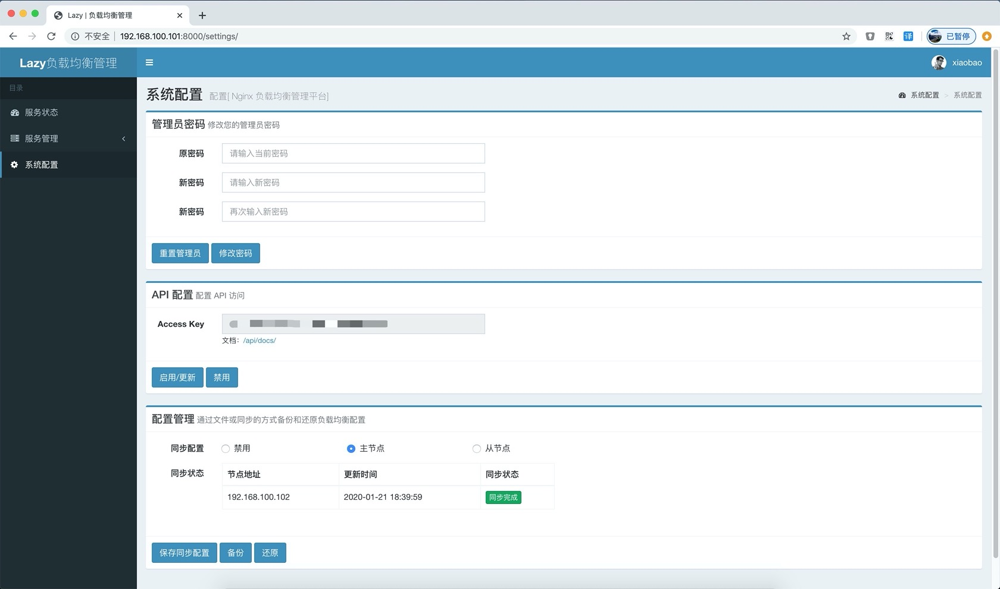
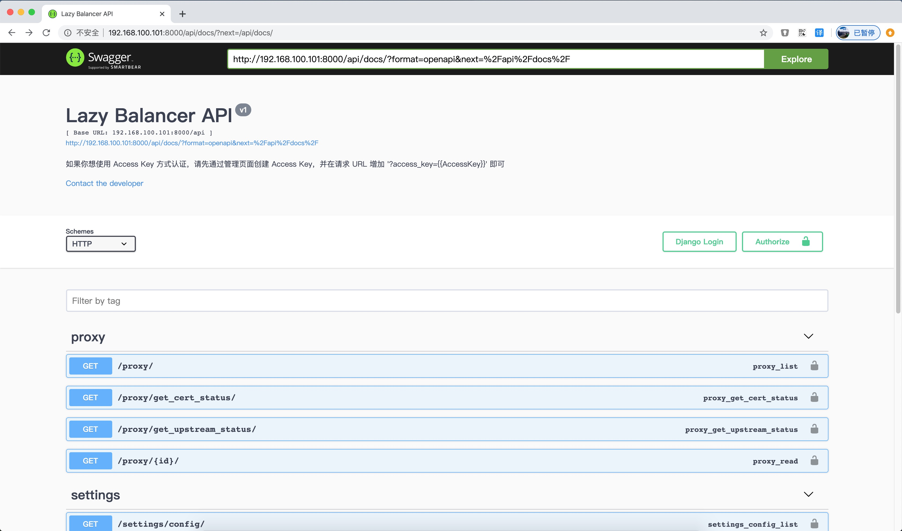
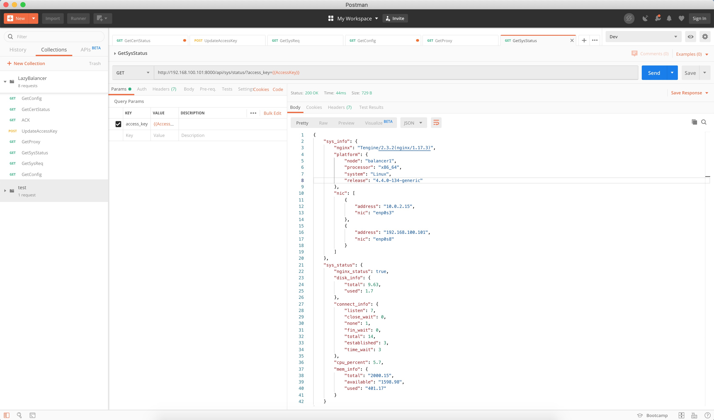

# Lazy-Balancer


项目起源于好哥们需要一个 7 层负载均衡器，无奈商业负载均衡器成本高昂，操作复杂。又没有特别喜欢（好看，好用）的开源产品，作为一名大 Ops 怎么能没有办法？正好最近在看 Django 框架，尝试自己给 Nginx 画皮，项目诞生！非专业开发，代码凑合看吧。

> * 项目基于 [Django](https://www.djangoproject.com/) + [AdminLTE](https://www.almsaeedstudio.com/) 构建，在 Ubuntu 18.04 上测试通过；为了保证良好的兼容性，请使用 Chrome 浏览器。
> * 为了后续扩展方便，请大家使用 [Tengine](http://tengine.taobao.org/) 替代 Nginx 服务

## 项目地址
- GITHUB - https://github.com/v55448330/lazy-balancer
- 码云 - http://git.oschina.net/v55448330/lazy-balancer
- OSCHINA - http://www.oschina.net/p/nginx-balancer

## 更新（2023-12-03）
* 更新 Python 到 3.9
* 更新 Tengine 到 3.1.0
* 更新 LuaJIT 到 20231006
* 更新 Alpine 到 3.18.4
* 更新 部分 Python 依项
* 优化 在所有保存配置操作前均执行 nginx -t 验证已存在配置，如果异常将不会执行配置渲染及后续操作
* 优化 状态页面拆分配置和进程状态，现在配置异常不会影响 Nginx 状态，将会独立显示 “配置异常” 状态
* 优化 服务启动流程，服务启动时将重新生成并应用配置文件，防止错误配置导致的启动失败
* 优化 修改状态/删除规则时，将允许只保存，不应用配置，以防止现有多条配置失效导致的 nginx 启动失败
* 优化 导入/保存/重新生成等操作将临时禁用按钮，防止重复点击导致的错误
* 优化 修改了规则保存逻辑，现在只有在规则检查失败后才会重新渲染配置，在规则数量较多时，极大提高保存速度
* 优化 默认关闭错误页服务器详细信息显示
* 新增 “重新应用配置” 功能，可以手动重新渲染或重载 Nginx 配置，默认重新渲染，选择取消后可选择仅重载配置
* 新增 stream 模块中 proxy_timeout 1800s 固定配置项
* 新增 check_shm_size 32M 固定配置项
* 新增 规则列表分页长度配置，默认 10 条，可配置 10-100 条分页
* 新增 测试支持 ARM 架构，pull 镜像可以使用 `--platform linux/arm64` 参数
* 新增 HTTP 类型规则后端节点域名动态检测 [ngx_upstream_jdomain](https://github.com/nicholaschiasson/ngx_upstream_jdomain) 实现，防止 upstream 域名 IP 变动，仅支持 HTTP 协议
* 新增 更换主动健康检测模块 [ngx_healthcheck_module](https://github.com/zhouchangxun/ngx_healthcheck_module)，以解决动态域名模块兼容性问题，并增加 TCP 规则的后端节点检测功能
* 修复 在 SSL 状态下打开后端域名开关不生效的问题
* 修复 部分情况下配置错误导入失败无法回滚的 Bug，优化了导入逻辑，略微提升了导入速度
* 修复 其他交互 Bug

## 更新（2021-06-16）
* IPv6 监听支持
* 更新 Tengine 至 2.3.3

## 更新（2020-01-21）
* 从该版本开始，将尝试部分功能 API 化，更多 API 文档见 `/api/docs`
* 尝试将 Python 更新至 Python3
* 修复 TCP 模式下端口占用检测无效的问题

## 更新（2019-11-22）
* 新增 TCP 负载均衡支持
* 新增配置同步功能
* 支持后端服务器为 HTTPS 协议，当后端为 HTTPS 协议时，HTTP 健康检测将使用发送 SSL Hello 包的方式
* 支持域名后端，配置为域名后端时禁用节点配置
* 新增 HTTP/2，Gzip 等配置
* 增加 Docker 支持
* 去除原 iptables 防火墙管理功能
* 当协议为 HTTP/HTTPS 时，允许用户自定义 Server 级别 Nginx 配置
* 当协议为 HTTP/HTTPS 时，可以在列表页预览后端节点状态
* 当协议为 HTTP/HTTPS 时，允许用户自定义后端节点域名，当未定义时，转发用户输入的域名
* 当协议为 HTTPS 时，可以在列表页预览证书过期状态，及获取证书信息
* 允许后端节点为域名格式
* 增加 HTTP/80，HTTPS/443 的默认规则，禁止直接 IP 访问（返回444），证书路径在 `/etc/nginx/default.*`，可自行更换
* 新增允许非标准 HTTP Header 转发（如下划线_）
* 修复其他 Bug

## 更新
* 将 Nginx 更换为 Tengine 以提供更灵活的功能支持以及性能提升
* 新增 HTTP 状态码方式检测后端服务器，默认 TCP 方式
* 新增 HTTP 状态码方式支持查看后端服务器状态
* 修复因前方有防火墙导致无法获取后端服务器状态
* 修复因主机头导致后端服务器探测失败
* 新增自定义管理员用户
* 新增配置通过文件备份和还原
* 新增实时查看访问日志和错误日志
* 新增实时请求统计
* 更新 Vagrantfile
* 修复其他 Bug

## 功能
* Nginx 可视化配置
* Nginx 负载均衡（反向代理）配置
* Nginx 证书支持
* 系统状态监测
* 支持 TCP 被动后端节点宕机检测
* 支持 HTTP 主动后端节点宕机检测
* 日志实时查询
* 请求统计

## 运行
### 容器
* 编译镜像
```
docker build -t <lazy-balancer>:<v1.3.7beta>
```
> 也可以 DockerHub `https://hub.docker.com/r/v55448330/lazy-balancer`

* 启动命令
```
docker run -d --restart=always --net=host --name=lazy_balancer \
    -v <db_dir>:/app/lazy_balancer/db \
    -v <log_dir>:/var/log/nginx \
    <lazy-balancer>:<v1.3.7beta> or v55448330/lazy-balancer:latest
```
* 初始化数据库
```
docker exec lazy_balancer python manage.py makemigrations --noinput 2>/dev/null
docker exec lazy_balancer python manage.py migrate --run-syncdb
```
### 主机
* 部署

> 部署方式参照 `deploy.sh` 脚本

* 初始化数据库
```
python manage.py makemigrations --noinput 2>/dev/null
python manage.py migrate --run-syncdb 
```
* 启动服务
```
supervisord -c /app/lazy_balancer/service/supervisord_docker.conf

or

supervisorctl start webui
supervisorctl start nginx
```
* 登录系统
```
http://[IP]:8000/  
```
> 首次登陆会要求创建管理员用户，如需修改，可在系统配置中重置管理员用户

## 演示






## 授权
本项目由 [小宝](http://www.ichegg.org) 维护，采用 [GPLv3](http://www.gnu.org/licenses/gpl-3.0.html) 开源协议。欢迎反馈！欢迎贡献代码！
